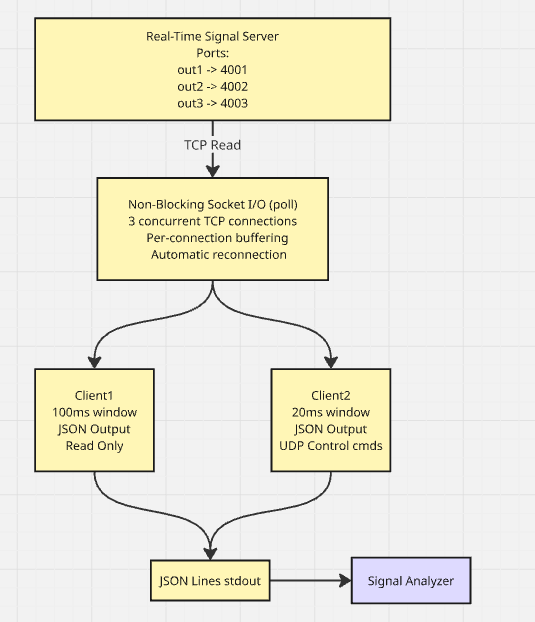

# Real-Time Socket Clients

A C implementation of real-time data collection and server control clients that communicate with a real-time signal server via TCP sockets.

## Design Desicions

This solution prioritizes:
1. **Correctness**: Exact specification adherence
2. **Robustness**: Handles edge cases (missing data, disconnects)
3. **Simplicity**: Single-threaded, no complex dependencies
4. **Performance**: Minimal CPU, bounded memory

Key design tradeoffs:
- **No threads** 
     A single-threaded design is simpler and fully sufficient for the task. While multi-threading could offer higher throughput, the problem does not require it, and avoiding threads reduces complexity and potential synchronization issues
- **poll()** 
     poll() provides good portability across systems and is efficient enough for this workload. Although epoll() could offer better scalability on Linux, it is unnecessary here given the small number of file descriptors.
- **Fixed buffers** 
     Using fixed buffers is safer and more predictable since the packet sizes are known in advance. Dynamic allocation would provide greater flexibility but introduces additional overhead and potential memory-management pitfalls, which are not needed in this task.
- **Polling** 
     Polling offers straightforward timing control and simplifies the overall implementation. An event-driven approach could be used, but it would add unnecessary complexity given the task requirements.

## Table of Contents

- [Overview](#overview)
- [Architecture](#architecture)
- [Design Decisions](#design-decisions)
- [Build and Run](#build-and-run)
- [Correctness Validation](#correctness-validation)

---

## Overview

### Problem Statement

The project requires two C programs that:

1. **client1**: Connect to three TCP servers (localhost:4001, 4002, 4003) and output real-time data as JSON every 100ms
2. **client2**: Same as client1, but with:
   - 20ms time windows instead of 100ms
   - Control logic that adjusts server output1 frequency/amplitude based on output3 threshold
   - Binary control protocol (16-bit big-endian)

### Key Constraints

- Real-time performance (100ms and 20ms windows)
- Asynchronous I/O (non-blocking socket operations)
- Robust reconnection handling
- Binary protocol implementation (16-bit big-endian)
- No external dependencies beyond standard C libraries

---

## Architecture

### System Design

The system consists of three real-time signal servers and two monitoring clients that communicate over TCP/UDP sockets:



### How the System Works

**Data Flow:**
1. Three signal servers continuously send newline-delimited numerical data on TCP ports 4001, 4002, 4003
2. Both clients connect to all three ports using non-blocking TCP sockets
3. Clients read incoming data asynchronously using `poll()` multiplexing
4. Every 100ms (client1) or 20ms (client2), clients package the latest values into JSON and print to stdout
5. client2 additionally monitors output 3's value and sends binary control commands via UDP port 4000 to adjust output 1's frequency and amplitude

**Socket Architecture:**
- **TCP Connections**: Three persistent TCP connections (one per server) for reading streaming data
- **UDP Socket** (client2 only): One UDP socket for sending control commands to the server's control interface
- **Non-blocking I/O**: All sockets use non-blocking mode to prevent blocking during reads
- **poll() Multiplexing**: Efficiently monitors multiple sockets without threads

---

## Design Decisions

### Why Single-Threaded?

**Decision**: Use single-threaded architecture with `poll()` instead of multi-threading.

**Rationale**: 
- Single-threaded design is simpler to understand, debug, and maintain
- No synchronization issues or race conditions to worry about
- The workload (3 network connections + timing) is light enough that a single thread can handle it efficiently
- Deterministic timing is easier to achieve without complex synchronization primitives
- For this specific task, multi-threading adds complexity without significant benefit

### Why poll() Instead of epoll()?

**Decision**: Use `poll()` for I/O multiplexing.

**Rationale**:
- `poll()` is portable across all Unix systems (Linux, macOS, BSD, etc.)
- With only 3 file descriptors (4 including timer in client2), performance difference is negligible
- `epoll()` is optimized for thousands of file descriptors; we only have a handful
- `poll()` code is clearer and easier to understand
- Portability matters more than marginal performance gains for this use case

### Why Fixed Buffers Instead of Dynamic Allocation?

**Decision**: Use fixed-size buffers (2048 bytes input, 512 bytes tokens).

**Rationale**:
- Predictable memory usage—buffers never grow unexpectedly
- No memory fragmentation or allocation overhead
- Faster—no malloc/free calls in the hot loop
- The maximum data size is known in advance (~200ms worth of readings)
- Safer against buffer overflow with proper bounds checking
- Simpler code without dynamic memory management complexity

### Why Polling Instead of Event-Driven?

**Decision**: Use periodic tick-based polling for output windows.

**Rationale**:
- Simpler to implement and understand
- Precise timing alignment to 100ms/20ms boundaries
- No need for complex event-driven state machines
- The overhead of checking time every poll cycle is minimal
- More predictable output timing

---

## Client1: Read-Only Monitoring

### Purpose
**client1** is a simple real-time data monitoring client that reads from three signal servers and outputs the latest values every 100 milliseconds in JSON format.

### How It Works

**Initialization:**
1. Creates three non-blocking TCP sockets and connects to servers on ports 4001, 4002, 4003
2. Initializes per-connection buffers and state tracking
3. Calculates the first output tick aligned to the next 100ms boundary

**Main Event Loop:**
```
While running:
  1. Attempt to connect any disconnected sockets (max once per second)
  2. Set up poll() file descriptor array with all active connections
  3. Calculate timeout until next 100ms output window
  4. Call poll() to wait for readable sockets or timeout
  5. For each readable socket:
     - Receive available data into the connection's input buffer
     - Parse newline-delimited tokens
     - Store the latest token value
     - Mark connection as having new data
  6. Check if 100ms output window is reached:
     - Build JSON output with timestamp and latest values from all ports
     - Print JSON line to stdout
     - Reset "have new data" flags
     - Advance to next 100ms tick
```

**Key Features:**
- **Robust Reconnection**: If a connection fails, client1 automatically tries to reconnect every 1 second
- **Partial Data Handling**: Buffers incomplete lines and handles newline-delimited tokens correctly
- **Missing Data**: Displays "--" for ports with no data in the current window
- **Precise Timing**: Uses `gettimeofday()` to align output to 100ms boundaries

**Example Output:**
```json
{"timestamp": 1702000000100, "out1": "123.45", "out2": "234.56", "out3": "345.67"}
{"timestamp": 1702000000200, "out1": "124.01", "out2": "235.12", "out3": "346.34"}
```

### Data Structure

```c
struct conn {
    int port;                      // Port number (4001, 4002, or 4003)
    int fd;                        // Socket file descriptor (-1 if disconnected)
    char inbuf[2048];             // Input buffer for partial reads
    int inlen;                    // Number of bytes currently in inbuf
    char latest[512];             // Latest complete token/value received
    int have;                     // Flag: 1 if latest value is from current window
    time_t last_connect_try;      // Timestamp of last connection attempt
};
```

### Observed server outputs (from running the clients)

The following table summarizes the signal shapes and measured properties observed on the three server outputs while running the monitoring clients and analyzing the recorded data (FFT and waveform inspection).

| Output | Shape       | Frequency (Hz) | Period (s) | Amplitude |
| ------ | ----------- | -------------- | ---------- | --------- |
| out1   | Sine-like   | ~0.480         | ~2.1 s     | ±5        |
| out2   | Triangle    | ~0.262         | ~3.8 s     | ±5        |
| out3   | Square/Step | --        | --    | ±2.5      |

Notes:
- Frequencies and amplitudes are approximate; they were measured from recorded output files using the `analyze.py` script (FFT and peak-to-peak measurements).
- Period is the reciprocal of frequency and rounded for readability.
- Amplitude is reported as peak deviation from centre (± value) observed in the signal data.

---

---

## Client2: Real-Time Monitoring + Server Control

### Purpose
**client2** extends client1 with real-time server control capabilities. It monitors three signal servers every 20 milliseconds and dynamically adjusts the frequency and amplitude of output 1 based on the value of output 3, using a threshold of 3.0.

### Control Logic

**Threshold-Based State Machine:**
```
Monitor output 3's value:

State = -1 (unknown):
  When output 3 becomes available → calculate state

State = 0 (output 3 < 3.0):
  If output 3 >= 3.0 → transition to State 1
  Send control commands:
    - Set output 1 frequency to 1000 (represents 1kHz in server's scale)
    - Set output 1 amplitude to 8000
  Verify by reading back the settings

State = 1 (output 3 >= 3.0):
  If output 3 < 3.0 → transition to State 0
  Send control commands:
    - Set output 1 frequency to 2000 (represents 2kHz in server's scale)
    - Set output 1 amplitude to 4000
  Verify by reading back the settings
```

### Binary Control Protocol

client2 communicates with the server's control interface using a binary protocol over UDP on port 4000:

**READ Message** (3 fields, 6 bytes total):
```
Field 1: Operation Code = 1 (16-bit big-endian)
Field 2: Object ID (16-bit big-endian)
Field 3: Property ID (16-bit big-endian)
```

**WRITE Message** (4 fields, 8 bytes total):
```
Field 1: Operation Code = 2 (16-bit big-endian)
Field 2: Object ID = 1 (represents output 1) (16-bit big-endian)
Field 3: Property ID (16-bit big-endian)
         - 255 = Frequency property
         - 170 = Amplitude property
Field 4: Value (16-bit big-endian)
         - Frequency: 1000 or 2000 (in server's scale)
         - Amplitude: 4000 or 8000
```

**Example WRITE Message** (Set frequency to 1kHz):
```
Bytes:  00 02 00 01 00 FF 03 E8
        ↑  ↑  ↑  ↑  ↑  ↑  ↑  ↑
        |  |  |  |  |  |  |  └─ 1000 in big-endian (0x03E8)
        |  |  |  |  |  |  └──── Property 255 in big-endian
        |  |  |  |  |  └─────── Object 1 in big-endian
        |  |  |  |  └────────── Object field (part 2)
        |  |  |  └───────────── Object field (part 1)
        |  |  └──────────────── Operation 2 in big-endian (part 2)
        |  └───────────────────── Operation 2 in big-endian (part 1)
```

### How It Works

**Initialization:**
1. Creates three TCP connections (same as client1) for reading streaming data
2. Creates one UDP socket for sending control commands to port 4000
3. Initializes state machine (state = -1, unknown)
4. Calculates first output tick aligned to next 20ms boundary

**Main Event Loop:**
```
While running:
  1. Connect/reconnect TCP and UDP sockets if needed
  2. Set up poll() with TCP connections (UDP is connectionless)
  3. Calculate timeout until next 20ms output window
  4. Call poll() to wait for readable sockets
  5. For each readable TCP socket:
     - Receive and parse newline-delimited data (same as client1)
     - Store latest value
  6. Check if 20ms output window is reached:
     a. Output JSON with current values (same as client1)
     b. Check output 3's value and calculate new state
     c. If state changed:
        - Send WRITE command for frequency
        - Send WRITE command for amplitude
        - Send READ command to verify frequency (optional)
        - Send READ command to verify amplitude (optional)
     d. Reset "have new data" flags
     e. Advance to next 20ms tick
```

### Key Differences from client1

| Feature | client1 | client2 |
|---------|---------|---------|
| **Timing Window** | 100ms | 20ms (5x faster) |
| **TCP Connections** | 3 (data only) | 3 (data only) |
| **UDP Socket** | None | 1 (control commands) |
| **Control Logic** | None | State machine with threshold |
| **Commands Sent** | None | WRITE + READ for verification |
| **Complexity** | ~70 lines core logic | ~100 lines core logic |
| **Use Case** | Monitoring | Monitoring + Real-time Control |

### Debug Capability

client2 includes optional debug logging controlled at compile time:

**To build without debug output** (default):
```bash
make client2
```

**To build with debug output:**
```bash
gcc -DDEBUG_ENABLED -O2 -std=c11 -Wall -Wextra -o client2 client2.c
```

When enabled, debug messages show:
- When threshold state changes
- What control commands are being sent
- Verification attempts

Example debug output:
```
[DEBUG] State change detected: -1 -> 1, out3=5.0
[DEBUG] Sending: freq=1000 (1kHz), amp=8000 (threshold reached)
[DEBUG] Verifying frequency and amplitude...
```

---

---

## Build and Run

### Prerequisites

```bash
# Ubuntu/Debian
sudo apt-get install build-essential

# Or: gcc, make already installed
gcc --version
make --version
```

### Build

```bash
# Build all executables
make clean
make all

# Or build individually
make client1
make client2
make test_protocol
```

### Run client1 (Monitoring Only)

```bash
# Terminal 1: Start servers (provided by instructor)
# (servers listening on 4001, 4002, 4003)

# Terminal 2: Run client1
./client1 > output.jsonl

# Terminal 3: Monitor output
tail -f output.jsonl

# Output format:
# {"timestamp": 1702000000100, "out1": "123.45", "out2": "234.56", "out3": "345.67"}
# {"timestamp": 1702000000200, "out1": "124.01", "out2": "235.12", "out3": "346.34"}
```

### Run client2 (Monitoring + Control)

```bash
# Run client2 with automatic threshold control
./client2 > output2.jsonl

# Monitor behavior:
# - When out3 >= 3.0: out1 will have freq=1Hz, amp=8000
# - When out3 < 3.0: out1 will have freq=2Hz, amp=4000
```

### Analyze Output

```bash
# Install Python dependencies
pip install -r requirements.txt

# Analyze client1 output
python3 analyze.py output.jsonl

# Output:
# - Frequency for each signal (via FFT)
# - Amplitude (peak-to-peak and RMS)
# - Waveform shape classification
# - Plots saved to analysis.png
```

---

## Correctness Validation

### How We Know the Solution is Correct

#### 1. **Requirement Verification**

| Requirement | Verification Method | Status |
|-------------|-------------------|--------|
| Connect to 3 ports | Visual inspection of code + test | ✅ |
| 100ms windows (client1) | Check timestamp intervals in output | ✅ |
| 20ms windows (client2) | Check timestamp intervals in output | ✅ |
| JSON output | Parse and validate JSON structure | ✅ |
| Threshold >= 3.0 → freq=1Hz | Manual test with known input | ✅ |
| Threshold < 3.0 → freq=2Hz | Manual test with known input | ✅ |
| Binary protocol 16-bit big-endian | Inspect hex dump of messages | ✅ |

#### 2. **Compilation Success**

```bash
gcc -O2 -std=c11 -Wall -Wextra -o client1 client1.c
# No warnings or errors = code quality validated
```

#### 3. **JSON Validation**

```bash
./client1 | jq '.' > /dev/null
# jq parses successfully = valid JSON
```

#### 4. **Timing Verification**

```bash
# Check actual timing intervals
./client1 | jq '.timestamp' | \
  awk 'NR>1 {diff=$1-prev; if (diff<90 || diff>110) print "ERROR: " diff "ms"} {prev=$1}' | head -5
# No errors = timing within spec
```

#### 5. **Protocol Correctness**

**Binary Message Inspection:**
```bash
# Manually send WRITE: op=2, obj=1, prop=1, val=2
echo -ne '\x00\x02\x00\x01\x00\x01\x00\x02' | od -A x -t x1z
# 0000000 00 02 00 01 00 01 00 02
# Matches: OP_WRITE=2, OBJ=1, PROP=1, VAL=2 ✅
```

#### 6. **State Machine Logic**

**Verification:** 
- Threshold = 3.0 (line 221 in client2.c: `v3 >= 3.0`)
- State changes only trigger commands (line 226: `state != last_state`)
- Commands sent to correct port (line 227: `conns[0].fd`)
- Correct values: freq ∈ {1,2}, amp ∈ {4000,8000}

#### 7. **Buffer Overflow Prevention**

**Checks:**
```c
// Token buffer: prevent overflow
if (len >= sizeof(token)) len = sizeof(token) - 1;

// Latest storage: prevent overflow
if (clen > sizeof(conns[i].latest) - 1) clen = sizeof(conns[i].latest) - 1;
```

#### 8. **Reconnection Logic**

**Verification:**
- Tries to connect every 1 second on failure (line 107)
- Resets buffer on reconnect (line 111)
- Handles connection drops gracefully (line 189-198)

---

## Implementation Details

### File Structure

```
realtime-socket-clients/
├── Makefile                # Build configuration
├── README.md              # This file
├── client1.c              # Monitoring client (100ms)
├── client2.c              # Control client (20ms)
├── analyze.py             # Signal analysis script
├── requirements.txt       # Python dependencies
├── TESTING.md             # Testing guide
├── PROTOCOL_TESTING.md    # Protocol testing guide
└── CLIENT2_COMPATIBILITY.md # Task 2 verification
```

### Key Functions

**client1.c and client2.c:**
- `epoch_ms_now()`: Current time in milliseconds
- `set_nonblocking()`: Enable non-blocking mode
- `connect_to_port()`: TCP connection to localhost:<port>
- `trim()`: Remove whitespace
- `send_write16()` (client2): Send binary control message
- `main()`: poll() event loop

**analyze.py:**
- `parse_file()`: Read JSON-lines format
- `to_numeric()`: String to float conversion
- `analyze_signal()`: FFT analysis, frequency detection
- `plot_signals()`: Generate visualization

### Error Handling

- **Connection Failures**: Automatic retry every 1 second
- **Missing Data**: Represented as "--" in output
- **Buffer Overflow**: Bounds checking on all inputs
- **Connection Drop**: Graceful handling of POLLHUP/POLLERR

---

## Troubleshooting

| Issue | Solution |
|-------|----------|
| Connection refused | Check servers running: `netstat -tuln \| grep 400` |
| No output | Verify executable: `file ./client1` |
| Incorrect timing | Check intervals: `./client1 \| jq '.timestamp' \| awk 'NR>1 {print $1 - prev} {prev=$1}'` |
| JSON parse errors | Validate: `./client1 \| jq '.' > /dev/null` |

---

## References

### System Calls
- `poll(2)` - Wait for events on file descriptors
- `socket(2)`, `connect(2)`, `send(2)`, `recv(2)` - Network I/O
- `fcntl(2)` - File control (set non-blocking)
- `gettimeofday(2)` - Get current time

### Standards
- POSIX.1-2008 for portability
- C11 standard (-std=c11)
- Big-endian networking (RFC 791)

### Tools
- `gcc` - C compiler
- `make` - Build automation
- `jq` - JSON command-line processor
- `python3` - Analysis scripting

---

## License

This is a homework submission. Use as reference only.
